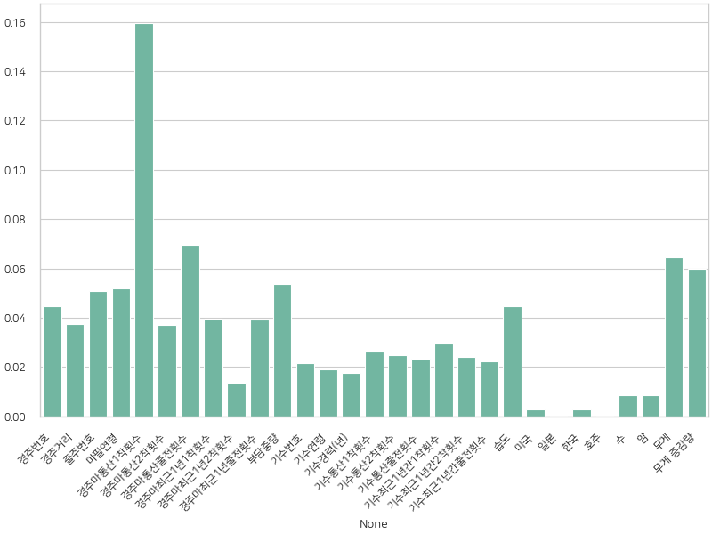
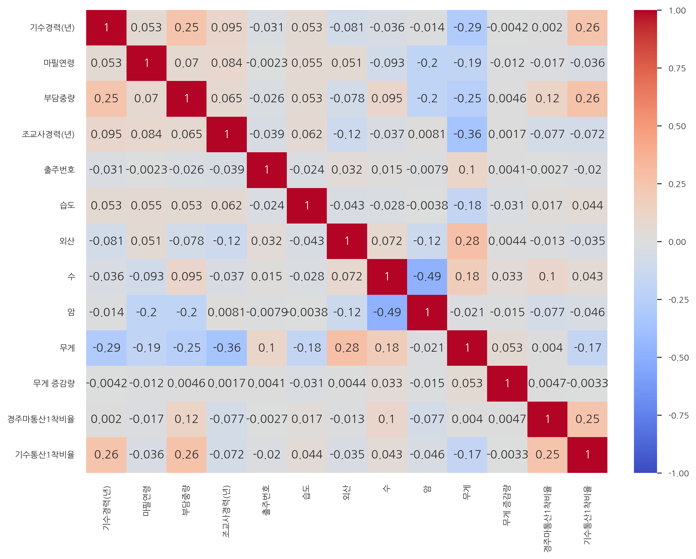
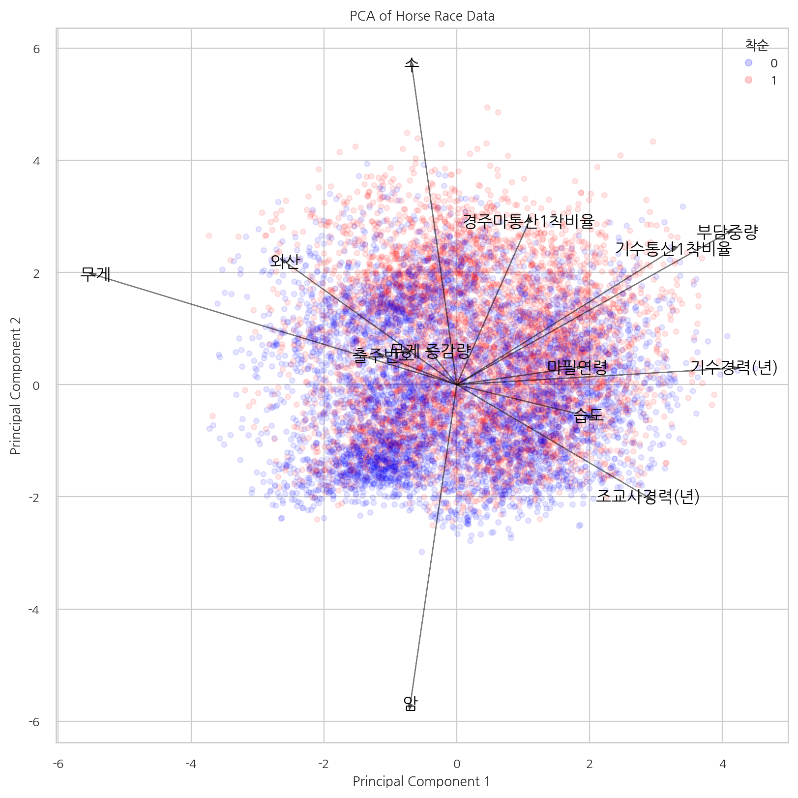
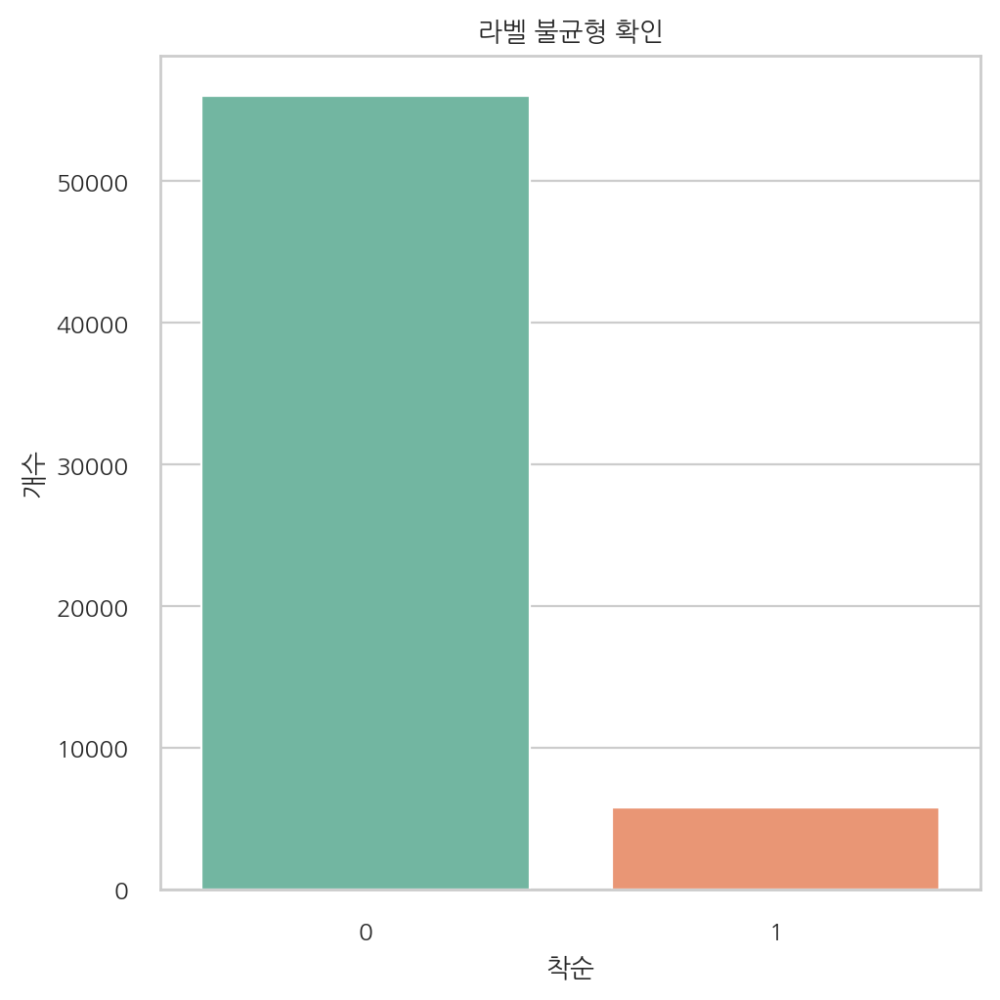
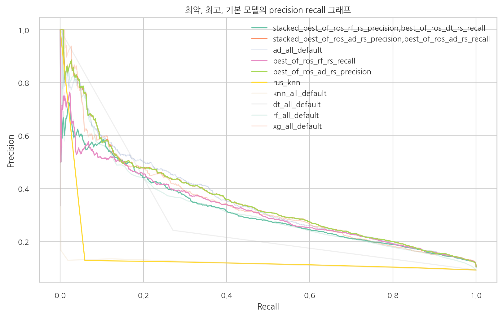
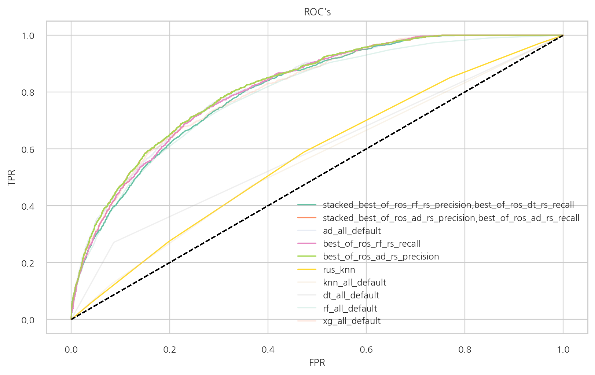

# 프로젝트 : 경마 예측(말 달리자)
### 1. 주제 선정 과정 및 프로토 타입
- 경마 1 등 맞추기
    - 데이터 출처 : [한국마사회_경주상세정보(제주_부경)_20230720 | 공공데이터포털 (data.go.kr)](https://www.data.go.kr/data/15116930/fileData.do)
    - 흥미로운 주제 일 것 같아 문득 머리속에서 떠올라서 찾아 봤는데 있었다.

- 의미 있는 데이터인지 확인해 보기
    - 기본적으로 프로토 타입을 만들고 나서 이 데이터가 제대로 작동하는 지 아닌지 부터 우선 판별 하게 되었다.
- [프로토타입 및 테스트](horse_proto.ipynb)

- 결정 

    - ROC 커브를 기준으로 보았을 때 모델이 유효 하다고 판단을 하게 되어 팀원들의 만장일치를 받고 경마 데이터를 이용하여 프로젝트를 진행할 수 있게 되었다.
    - 여기서 알 수 있는 사항
        - 이전대회때 1위를 많이 한 경주마의 영향이 크다.(경주마 통산 1착 횟수)
        

### 2. [horse_prep_v0_5_1.ipynb](horse_prep_v0_5_1.ipynb)
- 최종 corrolation : 
- 최종 PCA 결과 : 
- 최종 전처리 결과 해석
    - 경주마통산1착비율과 기수통산1착비율은 착순 1에서 약간 더 높은 경향이 있습니다.
    - 이는 1착 횟수가 많은 경주마와 기수가 더 높은 착순을 기록할 가능성을 시사합니다.

### 3. [horse_model_v0_5_4.ipynb](horse_model_v0_5_4.ipynb)
- 라벨 불 균형 : 
- 샘플링 기법 이용 : 
    ```py
    # 각 샘플링을 결과를 담을 dict 만들기
    x_y_name = {}

    # 랜덤 언더 샘플링
    rus = RandomUnderSampler(random_state=0)
    x_rus, y_rus = rus.fit_resample(train_x,train_y)

    # ENN
    enn = EditedNearestNeighbours(kind_sel="all", n_neighbors=5)
    x_enn, y_enn = enn.fit_resample(train_x,train_y)

    # RandomOver
    ros = RandomOverSampler(random_state=0)
    x_ros, y_ros = ros.fit_resample(train_x,train_y)

    # SMOTE
    smo = SMOTE(random_state=0)
    x_smo, y_smo = smo.fit_resample(train_x,train_y)

    smoenn = SMOTEENN(random_state=0)
    x_smoenn, y_smoenn = smoenn.fit_resample(train_x,train_y)

    x_y_name["rus"] = x_rus, y_rus
    x_y_name["enn"] = x_enn, y_enn
    x_y_name["ros"] = x_ros, y_ros
    x_y_name["smo"] = x_smo, y_smo
    x_y_name["smoenn"] = x_smoenn, y_smoenn
    ```

- 스택 모델 이용 및 모델별 비교 :
    - precision recall 그래프 : 
    - ROC 그래프 : 
### 피드백 정리

- 강사님의 피드백
    1. 발표시간이 길다.
    2. 프로젝트 목표 설정
        - 코드 리마인드, 코드 리뷰, 어려움 극복 → 1등 기수 예측
        - 회사에서 목표는 프로젝트가 구하고자 하는 문제 해결이다.
    3. 모델마다 편차가 큰데, 왜 편차가 큰지 따라갈 필요성이 있다.
    4. ppt 의 모델링 → 모델 로 변경
    5. 최악의 성능의 모델을 비교할 때, 왜 최악의 성능이 나왔는가에 대한 고찰이 필요하다.

- 멘토님의 피드백
    - 잘한 점
        - 평가 성능 은 아쉬운 부분은 없었다.
        - 불균형한 데이터에 대하여 다양한 샘플링 기법을 이용한 점.
    - 개선해야 할 점
        - 이진 분류가 아닌 다중분류 모델로도 만들어 봤으면 좋았을 것 같다.
            - 즉 단승식이 아닌, 복승식, 삼 복승식 등 - 인기가 더 많은 종목이다.
        - 데이터의 불균형이 심하여 모델이 오 분류하는 경우가 많아 실용성이 많이 떨어진다.
        - 0라벨에 대한 지표 또한 확인할 필요성이 있다.

- 개인적인 후기
    1. 코드를 여러사람이 분담하고, 작성하는 것의 큰 어려움
    2. 너무 불균형한 데이터에 대하여 좋은 결과가 나오는 것은 힘들다는 점, 샘플링이라는 기법은 개선을 하게 하긴 하지만 만능은 아니라는 점과 샘플링을 하여도 드라마틱한 개선은 없었다.
    3. 테스트 데이터의 정답라벨의 비율에 따라 confusion matrix가 확연히 변하기 때문에 테스트 데이터를 건들면 안된다는 점을 알게 되었다.
    4. 코드를 작성할 때, 변수 명의 가독성이 매우 중요하다는 것을 알 수 있었다.
        - 내가 작성한 코드가 다른 팀원에게 잘 읽힐 수 있게 작성을 해야 한다
    5. 학습이 오래 걸리는 모델들은 꼭 저장을 하여야 한다. 그렇지 않으면 또다른 수시간에서 수십시간이 소요가 된다.
    6. 팀장으로써, 어떻게 이끌어 가야 하는지 어려움을 느꼈고, 계획을 잘 세우고 그대로 진행을 해야 될 것 같다는 생각이 들었다.

